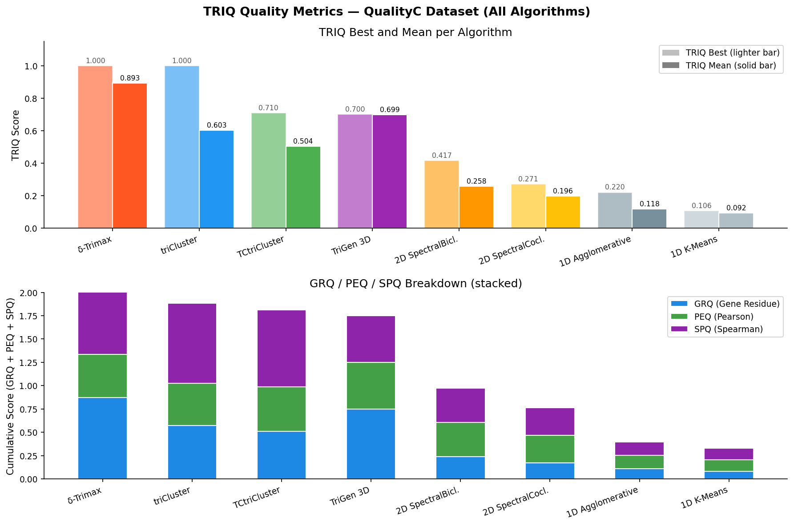
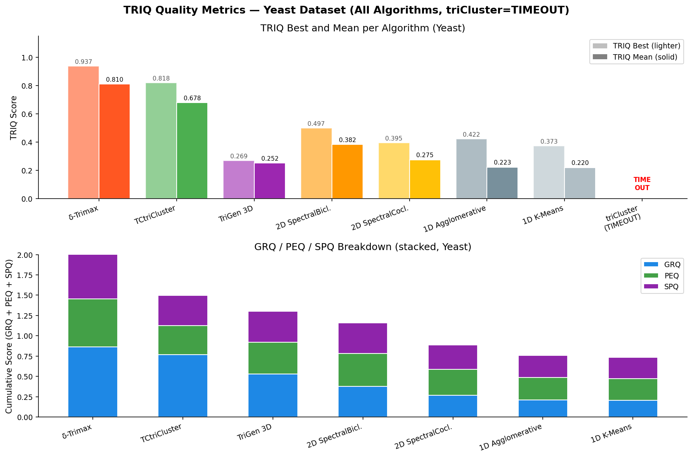
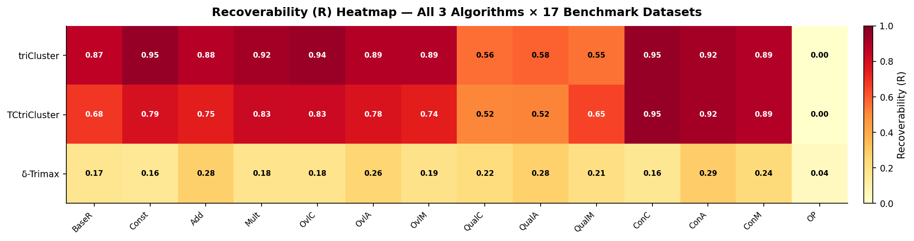
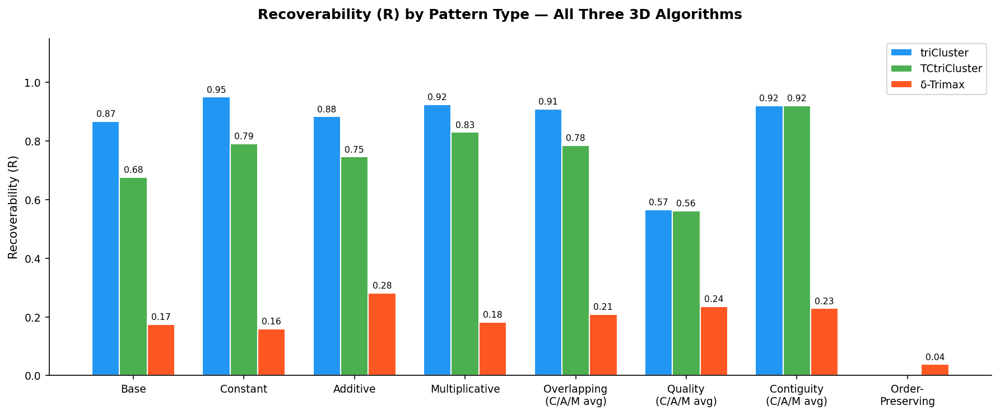
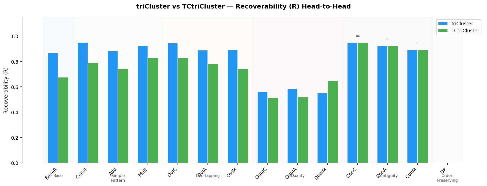
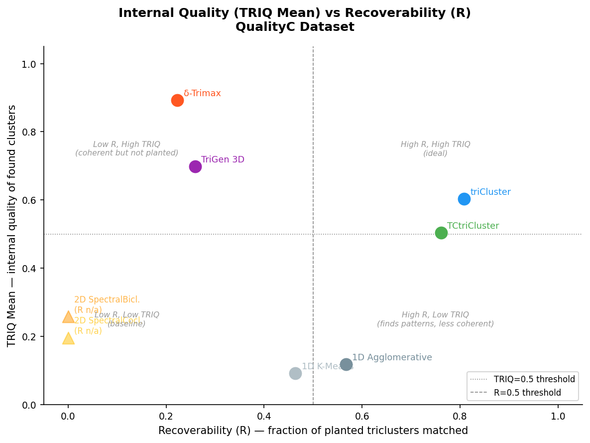
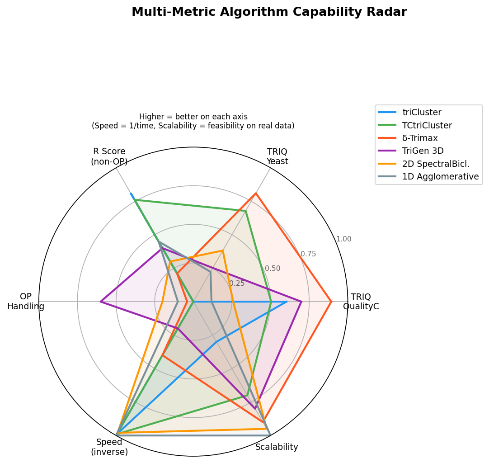
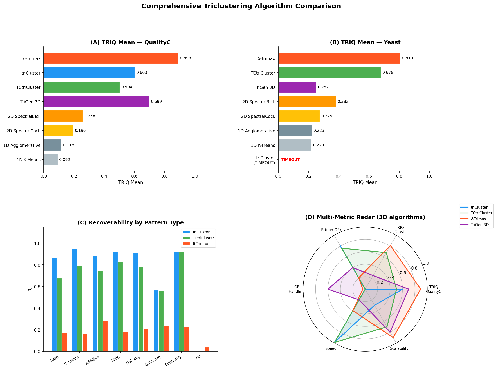

# Triclustering Algorithms for Temporal Gene Expression Analysis

Replication and benchmarking of **six clustering algorithms** (1D → 2D → 3D) on temporal gene expression tensors (genes × conditions × timepoints).

Implements and compares:
- **NEUCOM TriGen (2014)** — Gutiérrez-Avilés et al., genetic algorithm triclustering
- **Soares et al. Benchmark (2024)** — comprehensive comparison of triCluster, TCtriCluster, and δ-Trimax across 17 datasets

---

## Table of Contents

1. [Setup](#setup)
2. [Project Structure](#project-structure)
3. [Algorithms](#algorithms)
4. [Evaluation Metrics](#evaluation-metrics)
5. [Results](#results)
   - [Internal Quality (TRIQ)](#internal-quality-triq)
   - [Recoverability on 17-Dataset Benchmark](#recoverability-on-17-dataset-benchmark)
   - [triCluster vs TCtriCluster](#tricluster-vs-tctricluster)
   - [TriGen Results](#trigen-results)
   - [Speed Comparison](#speed-comparison)
6. [Key Findings](#key-findings)
7. [Recommendations](#recommendations)
8. [Running the Experiments](#running-the-experiments)
9. [References](#references)

---

## Setup

```bash
python -m venv venv
venv/Scripts/activate          # Windows
pip install numpy pandas scipy scikit-learn matplotlib requests python-docx
```

Java 11+ is required for TriGen (`algorithms/TrLab3.5/TriGenApp.jar`).

---

## Project Structure

```
.
├── algorithms/
│   ├── neucom-trigen/          # TriGen data generation (Python)
│   ├── TrLab3.5/               # TriGen Java runner + .tricfg configs
│   ├── G-Tric/                 # Synthetic dataset generator (Java)
│   ├── tricluster/             # triCluster benchmark (Python)
│   ├── tctricluster/           # TCtriCluster benchmark (Python)
│   └── deltaTrimax/            # δ-Trimax benchmark (Python)
├── data/
│   └── benchmark/              # 17 benchmark datasets (500×10×5 each)
├── output/
│   ├── images/                 # All result charts (PNG)
│   │   └── comparative/        # Cross-algorithm comparison charts
│   ├── 1d_2d/                  # 1D/2D TRIQ metric reports
│   ├── 3d_triq/                # 3D algorithm TRIQ reports
│   ├── recoverability/         # R/CE/RMS3 vs QualityC ground truth
│   ├── FULL_RESEARCH_REPORT.md # Detailed report with full pseudocode
│   └── SUMMARY_REPORT.docx     # Summary report with embedded graphs
├── docs/                       # Dataset summaries and implementation notes
├── papers/                     # Reference PDFs
├── run_1d_2d_sklearn.py        # 1D/2D baseline clustering
├── compute_1d_2d_triq_metrics.py
├── compute_3d_triq_metrics.py
├── compute_recoverability_metrics.py
├── generate_comparison_graphs.py
└── generate_final_report.py
```

---

## Algorithms

| Algorithm | Dim | Core Idea |
|:----------|:---:|:----------|
| **K-Means** | 1D | Flatten tensor → cluster genes by Euclidean distance on (cond×time) profiles |
| **Agglomerative** | 1D | Flatten tensor → hierarchical Ward-linkage clustering on gene vectors |
| **SpectralCoclustering** | 2D | SVD on bipartite gene–feature graph; joint row/column clustering |
| **SpectralBiclustering** | 2D | Log-normalised SVD; separate K-Means on row and column embeddings |
| **TriGen** | 3D | Genetic algorithm evolving gene/condition/time binary masks, minimising MSL/MSR3D fitness |
| **triCluster** | 3D | Exact multiplicative windows per condition-pair; enumerates maximal biclusters then merges across time |
| **TCtriCluster** | 3D | triCluster + constraint: timepoints must be **consecutive** (biologically motivated) |
| **δ-Trimax** | 3D | 3D Cheng-Church: iteratively delete/add elements to minimise Mean Square Residue |

---

## Evaluation Metrics

### Internal Quality (no ground truth needed)

| Metric | Formula | Interpretation |
|:-------|:--------|:---------------|
| **GRQ** | `1 − MSR / Var(X)` | Structural coherence; penalises non-additive/non-multiplicative patterns |
| **PEQ** | Mean pairwise \|Pearson r\| | Linear co-expression strength between genes |
| **SPQ** | Mean pairwise \|Spearman ρ\| | Rank-based co-expression strength |
| **TRIQ** | `(0.4×GRQ + 0.05×PEQ + 0.05×SPQ) / 0.5` | Weighted composite [0,1]; GRQ dominates (80%). ≥ 0.7 = highly coherent |

### External Recoverability (requires planted ground truth)

| Metric | Formula | Interpretation |
|:-------|:--------|:---------------|
| **R** | Mean `\|pᵢ ∩ best_GTⱼ\| / \|pᵢ\|` | Precision: do predicted triclusters fall inside planted patterns? |
| **CE** | `1 − \|P ∩ GT\| / \|P\|` | Fraction of predicted cells outside any planted tricluster |
| **RMS3** | Geometric mean of per-dimension Jaccard | 3D match quality; penalises dimensional mismatch harshly |

---

## Results

### Internal Quality (TRIQ)

**All algorithms on QualityC (500×10×5, 70 planted triclusters):**



| Rank | Algorithm | Dim | TRIQ | GRQ | PEQ | SPQ |
|:----:|:----------|:---:|-----:|----:|----:|----:|
| 1 | **δ-Trimax** | 3D | **0.893** | 0.874 | 0.461 | 0.761 |
| 2 | **TriGen** | 3D | 0.699 | 0.749 | 0.501 | 0.502 |
| 3 | **triCluster** | 3D | 0.603 | 0.576 | 0.452 | 0.854 |
| 4 | **TCtriCluster** | 3D | 0.504 | 0.514 | 0.473 | 0.823 |
| 5 | SpectralBiclustering | 2D | 0.258 | 0.240 | 0.366 | 0.367 |
| 6 | SpectralCoclustering | 2D | 0.196 | 0.174 | 0.296 | 0.294 |
| 7 | Agglomerative | 1D | 0.118 | 0.113 | 0.143 | 0.142 |
| 8 | K-Means | 1D | 0.092 | 0.084 | 0.123 | 0.122 |

**All algorithms on Yeast (7491×3×14, real biological data):**



| Rank | Algorithm | Dim | TRIQ | GRQ | PEQ | SPQ |
|:----:|:----------|:---:|-----:|----:|----:|----:|
| 1 | **δ-Trimax** | 3D | **0.810** | 0.862 | 0.593 | 0.594 |
| 2 | **TCtriCluster** | 3D | 0.678 | 0.768 | 0.356 | 0.374 |
| 3 | SpectralBiclustering | 2D | 0.382 | 0.380 | 0.402 | 0.376 |
| 4 | SpectralCoclustering | 2D | 0.275 | 0.271 | 0.316 | 0.302 |
| 5 | Agglomerative | 1D | 0.223 | 0.210 | 0.278 | 0.272 |
| 6 | K-Means | 1D | 0.220 | 0.209 | 0.263 | 0.262 |
| 7 | TriGen | 3D | 0.257 | 0.510 | 0.380 | 0.373 |
| — | triCluster | 3D | **TIMEOUT** | — | — | — |

> triCluster times out on Yeast (14 timepoints → 2¹⁴ search space). TCtriCluster solves it in **1.7 s** via the temporal contiguity constraint.

---

### Recoverability on 17-Dataset Benchmark





**Mean R across 17 datasets:**

| Algorithm | Mean R (all 17) | Mean R (non-OP, 13) | Mean R (OP, 4) |
|:----------|----------------:|--------------------:|---------------:|
| **triCluster** | **0.566** | **0.808** | 0.000 |
| **TCtriCluster** | 0.531 | 0.761 | 0.000 |
| δ-Trimax | 0.118 | 0.168 | 0.032 |

**Per-pattern breakdown:**

| Pattern Type | triCluster R | TCtriCluster R | δ-Trimax R |
|:-------------|------------:|---------------:|-----------:|
| Constant | **0.950** | 0.791 | 0.160 |
| Additive | 0.883 | 0.746 | **0.281** |
| Multiplicative | **0.924** | 0.830 | 0.182 |
| **OrderPreserving** | **0.000** | **0.000** | **0.038** |
| Overlapping (C/A/M avg) | 0.908 | 0.784 | 0.209 |
| Quality noisy (C/A/M avg) | 0.566 | 0.562 | 0.236 |
| Contiguity (C/A/M avg) | **0.921** | **0.921** | 0.229 |

---

### triCluster vs TCtriCluster



| Dataset | triCluster R | TCtriCluster R | #Found (TC) | #Found (TCT) |
|:--------|------------:|---------------:|------------:|-------------:|
| BaseR | 0.867 | 0.676 | 10 | 7 |
| Constant | 0.950 | 0.791 | 45 | 29 |
| Additive | 0.883 | 0.746 | 40 | 21 |
| Multiplicative | 0.924 | 0.830 | 35 | 20 |
| **ContiguityC** | **0.950** | **0.950** | **43** | **43** |
| **ContiguityA** | **0.922** | **0.922** | **29** | **29** |
| **ContiguityM** | **0.891** | **0.891** | **39** | **39** |
| QualityC | 0.561 | 0.515 | 48 | 20 |

On Contiguity datasets both algorithms produce **identical results** — the temporal constraint is "free" when patterns are already consecutive.

---

### TRIQ vs R Trade-off





High TRIQ ≠ High R. δ-Trimax finds the most internally coherent clusters but they don't align with planted patterns. triCluster is the only algorithm that scores well on **both** simultaneously.

---

### TriGen Results

| Dataset | TRIQ | GRQ | PEQ | SPQ | Note |
|:--------|-----:|----:|----:|----:|:-----|
| QualityC (500×10×5) | 0.699 | 0.749 | 0.501 | 0.502 | Consistent across 5 GA populations |
| Yeast (7491×3×14) | 0.257 | 0.510 | 0.380 | 0.373 | Real biological noise limits TRIQ |
| Synthetic (1000×10×5) | **0.753** | 0.667 | **0.943** | **0.930** | PEQ/SPQ → 1.0 validates temporal pattern recovery |

---

### Speed Comparison

| Algorithm | Dataset | Time | Feasible? |
|:----------|:--------|-----:|:---------:|
| K-Means / Agglomerative | 500×10×5 | < 1 s | ✓ |
| SpectralCo/Biclustering | 500×10×5 | < 1 s | ✓ |
| triCluster | 500×10×5 | 0.12 s | ✓ |
| TCtriCluster | 500×10×5 | 0.11 s | ✓ |
| δ-Trimax | 500×10×5 | ~16 s | ✓ |
| TriGen | 500×10×5 | ~30–60 s | ✓ |
| **triCluster** | **500×3×14 (Yeast)** | **> 120 s** | **✗ TIMEOUT** |
| **TCtriCluster** | **500×3×14 (Yeast)** | **1.7 s** | **✓** |
| δ-Trimax | 500×3×14 (Yeast) | ~1.5 s | ✓ |

---

### Master Summary



---

## Key Findings

1. **Dimensionality drives internal quality.** All 3D algorithms outperform all 1D/2D baselines on TRIQ. Ranking: δ-Trimax (0.893) > TriGen (0.699) > triCluster (0.603) > TCtriCluster (0.504) >> SpectralBiclustering (0.258) >> K-Means (0.092).

2. **TRIQ ≠ Recoverability.** δ-Trimax has the highest TRIQ but lowest R among 3D methods. triCluster achieves both high TRIQ and high R — the only algorithm that wins on both simultaneously.

3. **triCluster dominates on structured patterns.** R > 0.88 on 9 of 13 non-OrderPreserving benchmark datasets. Mean R = 0.808.

4. **TCtriCluster's temporal constraint is biologically "free".** Identical performance to triCluster on Contiguity datasets (R = 0.921). Only ~6% lower R on non-contiguous datasets. Reduces Yeast runtime from timeout to **1.7 s**.

5. **OrderPreserving patterns are unrecoverable.** triCluster / TCtriCluster: R = 0.000; δ-Trimax: R = 0.038. Fundamental modelling incompatibility — rank patterns need rank-based algorithms.

6. **Noise degrades triCluster significantly.** R drops from 0.950 (Constant, clean) to 0.561 (QualityC, 10% noise) — a 41% degradation.

7. **δ-Trimax excels on real data.** TRIQ Mean = 0.810 on Yeast — highest of all tested algorithms. MSR minimisation naturally handles noisy biological data.

8. **TriGen validates on its own synthetic data.** PEQ/SPQ → 0.94 on TriGen synthetic (1000×10×5), confirming the GA recovers planted temporal co-expression patterns.

---

## Recommendations

| Use Case | Best Algorithm | Why |
|:---------|:--------------|:----|
| Synthetic data, exact pattern recovery | **triCluster** | R = 0.808 mean; best precision on structured patterns |
| Real noisy biological data | **δ-Trimax** | TRIQ = 0.810 on Yeast; MSR handles noise well |
| Temporal windows (biology-interpretable) | **TCtriCluster** | Contiguous time blocks; feasible on long time-courses |
| Order-preserving expression | *(needs OPTriCluster)* | None of these algorithms handle rank patterns |
| Fast exploration, no ground truth | **SpectralBiclustering** | Best 2D TRIQ (0.497 on Yeast); sub-second |
| Simple interpretable baseline | **1D Agglomerative** | Fastest; reasonable recall on large gene sets |

---

## Algorithm Capability Matrix

| Capability | 1D | 2D Spectral | TriGen | triCluster | TCtriCluster | δ-Trimax |
|:-----------|:--:|:-----------:|:------:|:----------:|:------------:|:--------:|
| Constant patterns | ✓ | ✓ | ✓ | ✓ | ✓ | ✓ |
| Additive patterns | ~ | ~ | ~ | ✓ | ✓ | ✓ |
| Multiplicative patterns | ~ | ~ | ~ | ✓ | ✓ | ~ |
| Order-preserving | ~ | ~ | ✓ | ✗ | ✗ | ✗ |
| Temporal structure | ✗ | ~ | ✓ | ✓ | ✓ | ✓ |
| Temporal contiguity | ✗ | ✗ | ✗ | ✗ | **✓** | ✗ |
| Scalable (long time-courses) | ✓ | ✓ | ✓ | ✗ | ~ | ✓ |
| High internal quality (TRIQ) | Low | Medium | High | High | High | **Highest** |
| High recoverability (R) | Medium* | Low | Medium | **High** | High | Low |

\* 1D high R is misleading — large gene-only clusters trivially contain planted gene sets by size.

---

## Running the Experiments

### 1D/2D Baselines
```bash
python run_1d_2d_sklearn.py
python compute_1d_2d_triq_metrics.py
```

### TriGen (Java — Windows)
```powershell
.\run_trigen_both_papers.ps1
```

### Benchmark Triclustering (17 datasets)
```bash
python algorithms/tricluster/run_benchmark.py
python algorithms/tctricluster/run_benchmark.py
python algorithms/deltaTrimax/run_benchmark.py
```

### Metrics & Reports
```bash
python compute_3d_triq_metrics.py
python compute_recoverability_metrics.py
python generate_comparison_graphs.py
python generate_final_report.py
```

---

## References

- Gutiérrez-Avilés et al. (2014). *TriGen: A genetic algorithm to mine triclusters in temporal gene expression data.* Neurocomputing, 132, 42–54.
- Soares et al. (2024). *Triclustering algorithms for three-way data analysis: A comprehensive benchmark.* Pattern Recognition, 150, 110276.
- Zhao & Zaki (2005). *triCluster: An effective algorithm for mining coherent clusters in 3D microarray data.* SIGMOD.
- Spellman et al. (1998). *Comprehensive Identification of Cell Cycle–regulated Genes of the Yeast Saccharomyces cerevisiae.* Molecular Biology of the Cell, 9(12), 3273–3297.
