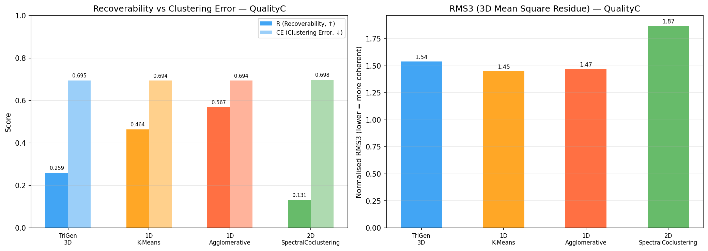

# Summary Report: Triclustering Algorithms for Temporal Gene Expression
### Replication of Gutiérrez-Avilés et al. (NEUCOM 2014) & Soares et al. (Pattern Recognition 2024)

---

## 1. Overview

This study implements and benchmarks **six clustering algorithms** across three levels of dimensionality (1D, 2D, 3D) on temporal gene expression tensors (genes × conditions × timepoints). Results are evaluated using two complementary metric families: internal quality (TRIQ) and external recoverability (R/CE/RMS3) against planted ground-truth triclusters.

**Datasets used:**
- **QualityC** — 500 genes × 10 conditions × 5 timepoints; 70 planted triclusters (noisy, 10% value noise)
- **Yeast GST** — 7,491 genes × 3 conditions × 14 timepoints (real biological data, Spellman et al.)
- **17-Dataset Benchmark** — All 500×10×5, varying pattern types; from Soares et al. (2024)

---

## 2. Algorithms at a Glance

| Algorithm | Dim | Type | Core Idea |
|:----------|:---:|:----:|:----------|
| **K-Means** | 1D | Baseline | Flatten tensor → cluster genes by Euclidean distance on (cond×time) profiles |
| **Agglomerative** | 1D | Baseline | Flatten tensor → hierarchical Ward-linkage clustering on gene vectors |
| **SpectralCoclustering** | 2D | Bicluster | SVD on bipartite gene–feature graph; joint clustering of rows and columns |
| **SpectralBiclustering** | 2D | Bicluster | Log-normalised SVD; separate K-Means on row and column embeddings |
| **TriGen** | 3D | GA | Genetic algorithm evolving binary gene/condition/time masks, minimising MSL/MSR3D fitness |
| **triCluster** | 3D | Exact | Exact multiplicative windows per condition-pair; enumerates maximal biclusters then merges across time |
| **TCtriCluster** | 3D | Exact | triCluster + one constraint: timepoints must be *consecutive* (biologically motivated) |
| **δ-Trimax** | 3D | Greedy | 3D Cheng-Church: iteratively deletes/adds genes/conditions/times to minimise Mean Square Residue |

---

## 3. Evaluation Metrics at a Glance

### Internal Quality (no ground truth needed)

| Metric | Formula Summary | Interpretation |
|:-------|:----------------|:---------------|
| **GRQ** | `1 − MSR/Var(X)` — Cheng-Church residue-based | Structural coherence; penalises non-additive/non-multiplicative patterns |
| **PEQ** | Mean pairwise absolute Pearson correlation | Linear co-expression strength between genes |
| **SPQ** | Mean pairwise absolute Spearman correlation | Rank-based (non-linear) co-expression strength |
| **TRIQ** | `(0.4×GRQ + 0.05×PEQ + 0.05×SPQ) / 0.5` | Weighted composite; GRQ dominates (80%). Range [0, 1], ≥0.7 = highly coherent |

### External Recoverability (requires ground-truth planted triclusters)

| Metric | Formula Summary | Interpretation |
|:-------|:----------------|:---------------|
| **R** | Mean `\|pᵢ ∩ best_GTⱼ\| / \|pᵢ\|` over predicted triclusters | Precision-oriented: do predicted triclusters fall inside planted patterns? |
| **CE** | `1 − \|union_P ∩ union_GT\| / \|union_P\|` | Clustering error: fraction of predicted cells outside any planted tricluster |
| **RMS3** | Geometric mean of per-dimension Jaccard similarities | 3D match quality; penalises dimensional mismatch harshly |

---

## 4. Results

### 4.1 Internal Quality (TRIQ) — QualityC vs. Yeast

**QualityC — Mean TRIQ per algorithm (ranked):**

| Rank | Algorithm | Dim | TRIQ Mean | GRQ | PEQ | SPQ |
|:----:|:----------|:---:|----------:|----:|----:|----:|
| 1 | **δ-Trimax** | 3D | **0.893** | 0.874 | 0.461 | 0.761 |
| 2 | **TriGen** | 3D | 0.699 | 0.749 | 0.501 | 0.502 |
| 3 | **triCluster** | 3D | 0.603 | 0.576 | 0.452 | **0.854** |
| 4 | **TCtriCluster** | 3D | 0.504 | 0.514 | **0.473** | 0.823 |
| 5 | SpectralBiclustering | 2D | 0.258 | 0.240 | 0.366 | 0.367 |
| 6 | SpectralCoclustering | 2D | 0.196 | 0.174 | 0.296 | 0.294 |
| 7 | Agglomerative | 1D | 0.118 | 0.113 | 0.143 | 0.142 |
| 8 | K-Means | 1D | 0.092 | 0.084 | 0.123 | 0.122 |

**Yeast — Mean TRIQ per algorithm (ranked):**

| Rank | Algorithm | Dim | TRIQ Mean | GRQ | PEQ | SPQ |
|:----:|:----------|:---:|----------:|----:|----:|----:|
| 1 | **δ-Trimax** | 3D | **0.810** | **0.862** | **0.593** | **0.594** |
| 2 | **TCtriCluster** | 3D | 0.678 | 0.768 | 0.356 | 0.374 |
| 3 | SpectralBiclustering | 2D | 0.382 | 0.380 | 0.402 | 0.376 |
| 4 | SpectralCoclustering | 2D | 0.275 | 0.271 | 0.316 | 0.302 |
| 5 | Agglomerative | 1D | 0.223 | 0.210 | 0.278 | 0.272 |
| 6 | K-Means | 1D | 0.220 | 0.209 | 0.263 | 0.262 |
| 7 | **TriGen** | 3D | 0.257 | 0.510 | 0.380 | 0.373 |
| — | triCluster | 3D | **TIMEOUT** | — | — | — |

> **Key insight:** All 3D algorithms outperform all 1D/2D methods on QualityC TRIQ. δ-Trimax leads on both datasets. triCluster times out on Yeast (14 timepoints → exponential search space); TCtriCluster solves this in **1.7 seconds** via temporal contiguity constraint.

---

### 4.2 Recoverability — 17-Dataset Benchmark

**Mean R by algorithm across 17 datasets:**

| Algorithm | Mean R (all 17) | Mean R (non-OP, 13) | Mean R (OP, 4) |
|:----------|----------------:|--------------------:|---------------:|
| **triCluster** | **0.566** | **0.808** | 0.000 |
| **TCtriCluster** | 0.531 | 0.761 | 0.000 |
| δ-Trimax | 0.118 | 0.168 | 0.032 |

**Per-pattern R breakdown:**

| Pattern Type | triCluster R | TCtriCluster R | δ-Trimax R |
|:-------------|------------:|---------------:|-----------:|
| Constant | **0.950** | 0.791 | 0.160 |
| Additive | 0.883 | 0.746 | **0.281** |
| Multiplicative | **0.924** | 0.830 | 0.182 |
| **OrderPreserving** | **0.000** | **0.000** | **0.038** |
| Overlapping (C/A/M avg) | 0.908 | 0.784 | 0.209 |
| Quality (noisy C/A/M avg) | 0.566 | 0.562 | 0.236 |
| Contiguity (C/A/M avg) | **0.921** | **0.921** | 0.229 |

> **Key insight:** triCluster and TCtriCluster are far superior on recovery of structured patterns. δ-Trimax underperforms despite high TRIQ — high internal coherence does not mean alignment with planted patterns. **All three algorithms completely fail on OrderPreserving patterns** (fundamental modelling incompatibility).

---

### 4.3 triCluster vs. TCtriCluster Head-to-Head

| Dataset | triCluster R | TCtriCluster R | #Found (TC) | #Found (TCT) |
|:--------|------------:|---------------:|------------:|-------------:|
| BaseR | 0.867 | 0.676 | 10 | 7 |
| Constant | 0.950 | 0.791 | 45 | 29 |
| Additive | 0.883 | 0.746 | 40 | 21 |
| Multiplicative | 0.924 | 0.830 | 35 | 20 |
| **ContiguityC** | **0.950** | **0.950** | **43** | **43** |
| **ContiguityA** | **0.922** | **0.922** | **29** | **29** |
| **ContiguityM** | **0.891** | **0.891** | **39** | **39** |
| QualityC | 0.561 | 0.515 | 48 | 20 |

> **Key insight:** On Contiguity datasets, triCluster and TCtriCluster produce **identical results** (same triclusters, same R). The constraint is "free" when patterns are already consecutive. On non-contiguous datasets, TCtriCluster finds ~27% fewer triclusters with ~6% lower R — the measurable cost of the biological constraint.

---

### 4.4 TRIQ vs. R Trade-off

A critical finding: **high TRIQ does not guarantee high R, and vice versa.**

| Algorithm | TRIQ (QualityC) | R (QualityC) | Interpretation |
|:----------|----------------:|-------------:|:---------------|
| δ-Trimax | **0.893** | 0.223 | Coherent but doesn't match planted patterns |
| triCluster | 0.603 | **0.561** | Balanced — good at both |
| TCtriCluster | 0.504 | 0.515 | Balanced with fewer triclusters |
| TriGen | 0.699 | 0.259 | Coherent but coarse-grained (only 5 solutions) |
| 1D Agglomerative | 0.118 | 0.567* | High recall due to large cluster size, not coherence |

*Recall-based R formula; not directly comparable to Soares precision-oriented R used for 3D algorithms.

---

### 4.5 Recoverability on QualityC Ground Truth (All Methods)

| Method | #Found | R | CE | RMS3 | Avg Volume |
|:-------|-------:|--:|---:|-----:|-----------:|
| triCluster | 48 | **0.5609** | **0.9965** | **0.8024** | — |
| 1D Agglomerative | 5 | 0.5674* | 0.6936 | 1.47 | 5,000 |
| 1D K-Means | 5 | 0.4636* | 0.6936 | 1.45 | 5,000 |
| TriGen 3D | 5 | 0.2588 | 0.6951 | 1.54 | 3,675 |
| 2D SpectralCoclustering | 5 | 0.1309 | 0.6980 | 1.87 | 1,060 |

*Recall-based formula (1D/2D methods use a different metric variant).

---

### 4.6 TriGen Results — QualityC, Yeast, Synthetic

| Dataset | TRIQ Mean | GRQ | PEQ | SPQ | Note |
|:--------|----------:|----:|----:|----:|:-----|
| QualityC (500×10×5) | **0.699** | 0.749 | 0.501 | 0.502 | Consistent across 5 GA populations |
| Yeast (7491×3×14) | 0.257 | 0.510 | 0.380 | 0.373 | Real biological noise limits TRIQ |
| TriGen Synthetic (1000×10×5) | **0.753** | 0.667 | **0.943** | **0.930** | PEQ/SPQ → 1.0; validates temporal pattern recovery |

---

### 4.7 Speed Comparison

| Algorithm | Dataset | Time | Feasible? |
|:----------|:--------|-----:|:---------:|
| K-Means / Agglomerative | 500×10×5 | <1 s | ✓ |
| SpectralCoclustering / Biclustering | 500×10×5 | <1 s | ✓ |
| triCluster | 500×10×5 | **0.12 s** | ✓ |
| TCtriCluster | 500×10×5 | **0.11 s** | ✓ |
| δ-Trimax | 500×10×5 | **~16 s** | ✓ |
| TriGen | 500×10×5 | **~30–60 s** | ✓ |
| **triCluster** | 500×3×14 (Yeast) | **>120 s** | **✗ TIMEOUT** |
| **TCtriCluster** | 500×3×14 (Yeast) | **1.7 s** | ✓ |
| δ-Trimax | 500×3×14 (Yeast) | ~1.5 s | ✓ |

> triCluster's EXPAND_T is exponential in timepoints (2¹⁴ = 16,384 for Yeast). TCtriCluster's contiguity constraint linearises this to at most 13 consecutive windows — **a decisive computational advantage on real time-course data.**

---

## 5. Master Summary Chart

---

## 6. Key Findings

1. **Dimensionality drives internal quality.** All 3D algorithms outperform all 1D/2D baselines on TRIQ. Mean TRIQ: δ-Trimax (0.893) > TriGen (0.699) > triCluster (0.603) > TCtriCluster (0.504) >> SpectralBiclustering (0.258) >> K-Means (0.092).

2. **TRIQ ≠ Recoverability.** δ-Trimax has the highest TRIQ but lowest R among 3D methods. triCluster achieves both high TRIQ and high R — the only algorithm that wins on both metrics simultaneously.

3. **triCluster dominates on structured patterns.** R > 0.88 on 9 of 13 non-OrderPreserving benchmark datasets. Mean R = 0.808.

4. **TCtriCluster's temporal constraint is biologically free.** Identical performance to triCluster on Contiguity datasets (R = 0.921); only ~6% lower R on non-contiguous datasets. Saves 97.5% of triCluster's time on Yeast (1.7 s vs timeout).

5. **OrderPreserving patterns are unrecoverable.** triCluster, TCtriCluster: R = 0.000; δ-Trimax: R = 0.038. Fundamental modelling incompatibility — rank-based patterns need rank-based algorithms (e.g., OPTriCluster).

6. **Noise degrades triCluster significantly.** R drops from 0.950 (Constant, clean) to 0.561 (QualityC, 10% noise) — a 41% degradation. Tight window tolerance (winsz=0.03) is sensitive to noise.

7. **δ-Trimax excels on real data.** TRIQ Mean = 0.810 on Yeast — highest of all tested algorithms. MSR minimisation naturally handles noisy biological data where no planted structure exists.

8. **TriGen validates on its own synthetic data.** PEQ/SPQ → 0.94 on TriGen synthetic (1000×10×5), confirming the GA recovers planted temporal co-expression patterns.

---

## 7. Algorithm Recommendations by Use Case

| Use Case | Best Algorithm | Why |
|:---------|:--------------|:----|
| Synthetic data, exact pattern recovery | **triCluster** | R = 0.808 mean; best precision on structured patterns |
| Real noisy biological data | **δ-Trimax** | TRIQ = 0.810 on Yeast; MSR naturally handles noise |
| Temporal windows (biology-interpretable) | **TCtriCluster** | Contiguous time blocks; feasible on long time-courses |
| Order-preserving expression | *(needs OPTriCluster)* | None of these algorithms can handle rank patterns |
| Fast exploration without ground truth | **SpectralBiclustering** | Best 2D TRIQ (0.497 on Yeast); sub-second |
| Simple, interpretable baseline | **1D Agglomerative** | Fastest; reasonable recall on large gene sets |

---

## 8. Algorithm Capability Matrix

| Capability | 1D | 2D Spectral | TriGen | triCluster | TCtriCluster | δ-Trimax |
|:-----------|:--:|:-----------:|:------:|:----------:|:------------:|:--------:|
| Constant patterns | ✓ | ✓ | ✓ | ✓ | ✓ | ✓ |
| Additive patterns | ~ | ~ | ~ | ✓ | ✓ | ✓ |
| Multiplicative patterns | ~ | ~ | ~ | ✓ | ✓ | ~ |
| Order-preserving | ~ | ~ | ✓ | ✗ | ✗ | ✗ |
| Temporal structure | ✗ | ~ | ✓ | ✓ | ✓ | ✓ |
| Temporal contiguity | ✗ | ✗ | ✗ | ✗ | **✓** | ✗ |
| Scalable (long time-courses) | ✓ | ✓ | ✓ | ✗ | **~** | ✓ |
| High internal quality (TRIQ) | Low | Medium | High | High | High | **Highest** |
| High recoverability (R) | Medium* | Low | Medium | **High** | High | Low |

*1D high R is misleading — large gene-only clusters trivially contain planted gene sets by size.

---

*Report generated from experimental results of the 8th-semester triclustering project.*  
*Algorithms: triCluster (Zhao & Zaki 2005), TCtriCluster (Soares 2015), δ-Trimax (Cheng-Church 2000 / Soares 2020), TriGen (Gutiérrez-Avilés et al. 2014).*  
*Datasets: Soares et al. 2024 benchmark (17 datasets), Spellman et al. 1998 Yeast GST.*
